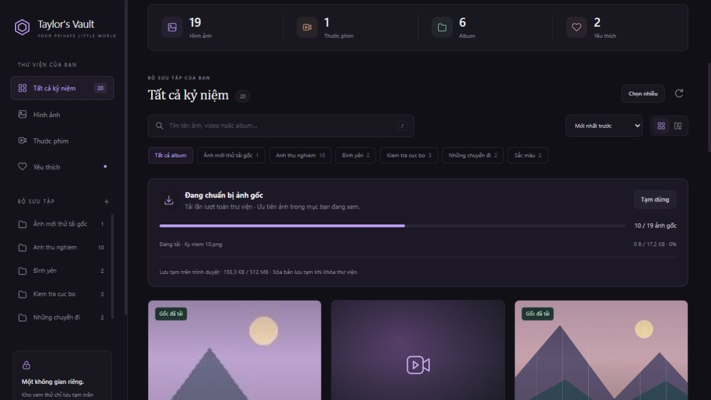
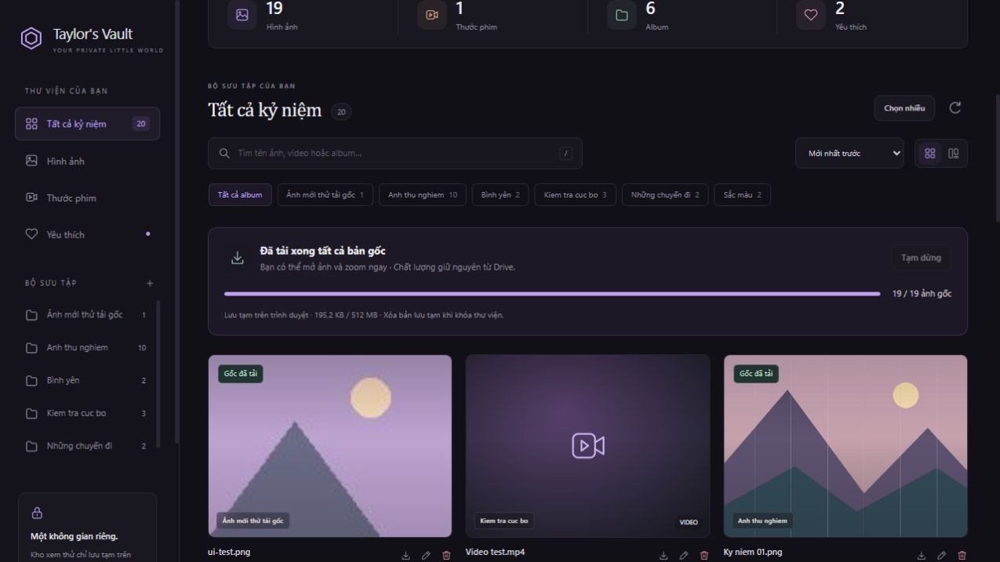

# Tự tải trước ảnh gốc — cách dùng và tự chỉnh

Bản cập nhật ngày 02/10/2026. Website tự chuẩn bị ảnh gốc sau khi bạn mở khóa, tải lần lượt toàn bộ thư viện ảnh. Khi mở một ảnh có nhãn **Gốc đã tải**, cửa sổ xem dùng bản lưu tạm trên trình duyệt, không chờ tải lại từ Google Drive. Ảnh vẫn giữ nguyên dữ liệu và độ phân giải gốc; việc đọc/giải mã ảnh trên máy vẫn cần một chút thời gian.

Đây là tính năng trong bộ mã nguồn mới. Bạn cần cập nhật GitHub và để Render triển khai bản mới thì website thật mới có tính năng này. Không cần tạo lại token Drive hoặc thay mật khẩu.

## 1. Thanh trạng thái cho biết những gì?

Thanh **Chuẩn bị ảnh gốc** nằm phía trên lưới ảnh:



- **12 / 50 ảnh gốc:** đã tải hoàn chỉnh và lưu được 12 bản gốc trên trình duyệt này, tổng cộng có 50 ảnh trong toàn thư viện. Đếm tất cả ảnh, kể cả ảnh ở album khác hoặc chưa hiện trên lưới; không đếm video.
- **Đang tải · tên ảnh:** ảnh đang được chuẩn bị, số byte và phần trăm của riêng ảnh đó. Nếu máy chủ không cung cấp tổng dung lượng, chỉ hiện số byte đã nhận và thanh đang chạy.
- **Đã tải xong tất cả bản gốc:** mọi ảnh hiện có đã tải xong. Thanh tổng chỉ tính ảnh hoàn chỉnh, không báo 100% chỉ vì đã gửi yêu cầu.
- **Gốc đã tải:** nhãn nhỏ trên thẻ ảnh. Bấm mở dùng bản đã tải; zoom 1:1 và bảng info vẫn hoạt động.
- **Đã đạt giới hạn lưu tạm:** vẫn còn ảnh chưa tải trước. Những ảnh đã tải được giữ lại, không tự xóa rồi tải xoay vòng. Bạn vẫn mở ảnh còn lại để tải gốc khi cần.
- **Một số bản gốc chưa tải được:** lỗi không được tính là hoàn tất. Bấm **Thử lại ảnh lỗi** sau khi mạng ổn định.

“Đã tải” nói về dữ liệu gốc đã nhận đủ, không phải cam kết trình duyệt hỗ trợ mọi định dạng. HEIC/TIFF hoặc một số codec vẫn có thể cần tải file về và mở bằng ứng dụng phù hợp.



## 2. Vì sao dùng cả ảnh nhẹ và bản gốc?

Lưới tiếp tục dùng ảnh nhẹ để bạn tìm và cuộn nhanh. Một hàng đợi riêng tải bản gốc từng ảnh, ưu tiên ảnh trong album/kết quả bạn đang xem, rồi tiếp tục các ảnh còn lại trong thư viện. Website không giải mã và giữ tất cả ảnh lớn trên màn hình cùng lúc.

Nếu bạn mở ảnh đang tải, cửa sổ xem chờ chính lượt tải đó, không tải trùng. Nếu mở một ảnh chưa được chuẩn bị, trang có thể dùng thêm một lượt tải ưu tiên; tối đa hai lượt tải gốc cùng lúc trong một trang. Hàng đợi nền chờ các lượt này hoàn tất rồi tiếp tục. Ảnh đã tải xong được dùng lại ở các lần mở sau trong cùng phiên.

Ảnh mới được tự thêm vào hàng đợi. Khi sửa tên, album hoặc yêu thích, checksum nội dung do Drive cung cấp giúp giữ lại bản gốc không thay đổi. Nếu nội dung ảnh thay đổi hoặc tệp bị xóa, bản lưu cũ được loại khỏi danh sách khi thư viện cập nhật.

## 3. Tạm dừng, tiếp tục và giữ tiến độ

- **Tạm dừng:** ảnh đang tải được hoàn tất để không phí phần dữ liệu đã tải; các ảnh kế tiếp chờ. Những bản đã tải vẫn mở được. Bạn vẫn có thể bấm mở một ảnh khác để tải riêng ảnh đó.
- **Tiếp tục:** tiếp tục những ảnh còn thiếu; không bắt đầu lại từ đầu.
- **Thử lại ảnh lỗi:** chỉ thử lại những ảnh lỗi/chưa tải được, giữ nguyên những ảnh đã có.
- Khi bạn đang gửi ảnh/video lên Drive, hàng đợi nền chờ sau ảnh đang tải và tiếp tục khi việc tải lên xong.
- Khi mất mạng, hàng đợi chờ kết nối trở lại. Ảnh đã tải vẫn có thể xem trong trang đang mở; đây không phải chế độ đăng nhập/xem toàn website ngoại tuyến.
- Tải lại trang trong cùng phiên mở khóa: giữ các bản đã tải nếu trình duyệt hỗ trợ lưu tạm. Chế độ tự tải lại theo cấu hình mặc định; lựa chọn Tạm dừng không được nhớ qua lần tải lại trang. Một ảnh đang tải dở có thể phải tải lại từ đầu.

Giữ trang mở trong lúc chuẩn bị thư viện. Khi bạn đóng tab/trình duyệt, hoặc điện thoại đưa trình duyệt vào trạng thái ngủ, việc tải có thể dừng. Tính năng không chạy trên máy chủ khi bạn đã đóng website.

## 4. Tự tăng dung lượng hoặc tắt tải trước

Mở file **`static/settings.js`** trong thư mục đã giải nén. Tìm ba dòng này:

```javascript
  preloadOriginals: true,
  originalCacheMB: 512,
  originalMemoryMB: 64,
```

| Mục | Ý nghĩa | Cách chỉnh |
|---|---|---|
| `preloadOriginals` | Bật tự tải ảnh gốc toàn thư viện | `true` để bật, `false` để chỉ tải khi mở; vẫn có nút Tiếp tục để bật trong trang |
| `originalCacheMB` | Trần dung lượng lưu tạm bản gốc trên trình duyệt | Mặc định `512`, chấp nhận từ `16` đến `4096` MB |
| `originalMemoryMB` | Trần RAM khi trình duyệt không hỗ trợ/không cho lưu tạm trên thiết bị | Mặc định `64`, chấp nhận từ `16` đến `256` MB; không cần tăng nếu trang hiện “Lưu tạm trên trình duyệt” |

Ví dụ, bạn chủ yếu xem trên máy tính và kho ảnh khoảng 1,5 GB:

```javascript
  preloadOriginals: true,
  originalCacheMB: 2048,
  originalMemoryMB: 64,
```

Kho khoảng 100 ảnh × 5 MB cần khoảng 500 MB. Nếu muốn tải trước hết, đặt `originalCacheMB` cao hơn tổng dung lượng ảnh một chút. Máy có ít chỗ trống hoặc điện thoại có thể dùng `256`; khi đó kho lớn hơn sẽ chỉ được chuẩn bị một phần. Số MB trong cấu hình được tính theo 1024 × 1024 byte.

Trình duyệt cũng có hạn mức riêng. Website lấy tối đa 30% phần dung lượng còn lại mà trình duyệt báo, và không vượt giá trị bạn đặt. Vì vậy nhập `4096` không đảm bảo thiết bị giữ được đủ 4 GB. Nếu chỗ lưu đầy, trang dừng tải trước, báo số ảnh còn thiếu và vẫn cho mở ảnh gốc. Bản gốc vượt trần lưu tạm được mở trực tiếp khi bấm xem.

Chỉ sửa giá trị bên phải. Giữ dấu phẩy cuối dòng; `true`/`false` và số không đặt trong dấu nháy. Lưu file, cập nhật GitHub, chờ Render deploy và bấm **Ctrl+F5**. Nếu kho vẫn không đủ chỗ, xem phần dung lượng trên thanh trạng thái; nó phản ánh giới hạn thực tế của trình duyệt, không chỉ con số bạn nhập.

## 5. Bản lưu nằm ở đâu và giữ bao lâu?

Trên trình duyệt hỗ trợ, bản gốc được giữ trong kho tạm của website trên thiết bị. Không có file tự xuất ra thư mục Downloads. Muốn có file lưu riêng, dùng nút tải về như trước.

Bản tạm được gắn với phiên mở khóa, tách riêng khỏi mật khẩu/cookie đăng nhập. Bạn tải lại trang hoặc mở thêm tab trong cùng phiên thì có thể dùng lại các ảnh hoàn chỉnh. Mỗi trang có hàng đợi riêng; để tránh tải trùng các ảnh chưa xong, nên chỉ giữ một tab trong lúc chuẩn bị kho.

**Khóa thư viện** sẽ dừng tải, đóng ảnh đang xem và yêu cầu trình duyệt xóa kho tạm của phiên đó. Các tab đang mở cùng website được thông báo khóa qua BroadcastChannel khi trình duyệt hỗ trợ. Phiên hết hạn tối đa sau 12 giờ; trang cũng tự khóa theo thời hạn đó. Khóa thư viện không xóa ảnh thật trên Drive.

Trình duyệt có thể tự thu hồi dữ liệu tạm khi thiếu chỗ, ở chế độ riêng tư, hoặc khi bạn xóa dữ liệu website. Bản tạm không thay thế bản sao lưu. Nếu dịch vụ restart và phiên cũ không còn hợp lệ, cần mở khóa lại; các kho tạm cũ quá 12 giờ được dọn vào một lần mở khóa sau. Cache không được dùng để bỏ qua màn hình đăng nhập.

Nếu trang hiện **Lưu tạm trong bộ nhớ**, trình duyệt không hỗ trợ/không cho dùng kho tạm. Trang dùng RAM có giới hạn và không giữ tiến độ khi tải lại trang. Việc lưu tạm trên thiết bị cần HTTPS; website Render có HTTPS, còn khi thử trên máy dùng địa chỉ `http://127.0.0.1:8000` hoặc `http://localhost:8000`.

## 6. Cập nhật bản này lên website hiện có

1. Tải và giải nén **Taylors-Vault-Originals-Preload.zip**. Mở thư mục `gallery-updated` bên trong.
2. Giữ nguyên các biến bí mật đã cấu hình trên Render. Không đưa token/mật khẩu vào GitHub.
3. Trong GitHub, mở repo `taylor-secret-vault` và đúng branch mà Render đang chạy. Nếu `main.py` đang ở gốc repo, đưa **nội dung bên trong** `gallery-updated` vào gốc repo. Nếu bạn đặt code trong thư mục con, Root Directory trên Render phải trỏ tới thư mục chứa `main.py`.
4. Cập nhật **đầy đủ bộ mã** trong một commit, nhất là `main.py`, `storage.py`, `index.html`, toàn bộ `static/` gồm file mới `originals.js`, `settings.js`, `app.js`, `style.css`. Không chỉ thay JavaScript: bản này cần thông tin phiên từ server và các nút/thanh mới trong HTML.
5. Commit bằng tên dễ nhớ, ví dụ `Add automatic original photo preload`.
6. Trên Render, chọn **Manual Deploy → Deploy latest commit** nếu chưa tự deploy. Build Command giữ `pip install -r requirements.txt`.
7. Start Command chỉ dán đúng dòng dưới:

```text
uvicorn main:app --host 0.0.0.0 --port $PORT --workers 1 --proxy-headers --forwarded-allow-ips '*'
```

8. Khi dịch vụ báo Live, mở [website của bạn](https://taylor-secret-vault.onrender.com/), bấm **Ctrl+F5**, mở khóa thư viện. Thanh tải gốc bắt đầu chạy.
9. Chờ một vài ảnh có nhãn **Gốc đã tải**, mở ảnh, zoom 1:1, đóng và mở lại. Thử tải lại trang: các ảnh đã hoàn chỉnh vẫn được tính nếu đang dùng lưu tạm trên trình duyệt và phiên chưa hết hạn.

Nếu muốn hướng dẫn từ đầu về Drive, GitHub và Render, mở [HUONG_DAN.html](HUONG_DAN.html). Nếu lại gặp tình trạng các nút không phản hồi, mở [SUA_LOI_MO_ANH.html](SUA_LOI_MO_ANH.html).

## 7. Các tình huống thường gặp

| Hiện tượng | Ý nghĩa và cách xử lý |
|---|---|
| Không thấy thanh tải gốc | Render còn chạy bản cũ, sai branch/Root Directory hoặc cập nhật thiếu HTML. Cập nhật đầy đủ, deploy lại, Ctrl+F5. |
| Bản cập nhật chưa hoàn tất | Thiếu file mới hoặc HTML/JavaScript không khớp phiên bản; dùng cả bộ ZIP. |
| Đã tải 30/100 rồi dừng | Xem tiêu đề: có thể tạm dừng, mất mạng, lỗi ảnh hoặc đạt giới hạn lưu. Tăng cấu hình chỉ giúp trường hợp trần bạn đặt quá nhỏ; trình duyệt vẫn có thể giới hạn thấp hơn. |
| Ảnh lớn nhất chưa tải trước nhưng các ảnh nhỏ đã xong | Khi ảnh lớn không vừa chỗ lưu còn lại, hàng đợi chuyển sang ảnh nhỏ hơn; mở ảnh lớn vẫn xem/tải được bản gốc. |
| Phần trăm đạt 100% nhưng số ảnh chưa tăng ngay | Dữ liệu đã nhận xong nhưng trình duyệt đang ghi bản tạm. Chỉ cộng sau khi ghi thành công. |
| Ảnh báo lỗi | Kiểm tra mạng/quyền Drive, bấm Thử lại ảnh lỗi. Thử mở/tải gốc để biết file thật có dùng được không. |
| Đổi tên làm một ảnh phải tải lại | Drive thường có checksum nội dung để giữ bản cũ. Nếu thiếu checksum, phiên bản/ngày sửa được dùng thay thế và có thể yêu cầu tải lại. |
| Đã tải xong nhưng ảnh vẫn không mở | Định dạng có thể không được trình duyệt hỗ trợ; tải gốc về, hoặc dùng JPEG/PNG/WebP để xem rộng rãi. |
| Mở trên thiết bị khác chưa có bản gốc | Bản tạm nằm trên từng trình duyệt/thiết bị; cần chuẩn bị ở thiết bị mới. |
| Mạng/Render vẫn chậm | Tải trước dời thời gian chờ sang lúc chuẩn bị, không tăng tốc đường truyền. Lần tải đầu vẫn đi qua Drive → Render → trình duyệt. |

Tải trước toàn kho dùng băng thông tương ứng với dung lượng ảnh thật, kể cả ảnh bạn không mở. Dùng nút Tạm dừng khi cần; không tải video trước để tránh tiêu tốn nhiều dữ liệu. Kết quả kiểm tra đi kèm là demo tại máy, chưa đo tốc độ Drive/Render thật của bạn.

Chi tiết nền tảng: [MDN — CacheStorage](https://developer.mozilla.org/en-US/docs/Web/API/CacheStorage), [MDN — hạn mức và thu hồi bộ nhớ](https://developer.mozilla.org/en-US/docs/Web/API/Storage_API/Storage_quotas_and_eviction_criteria), [Google Drive — checksum nội dung tệp](https://developers.google.com/workspace/drive/api/reference/rest/v3/files).
